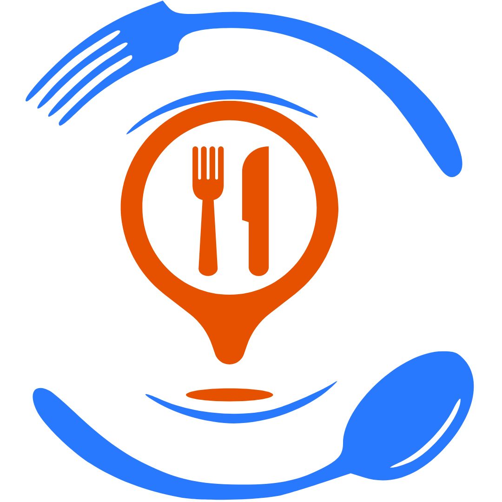
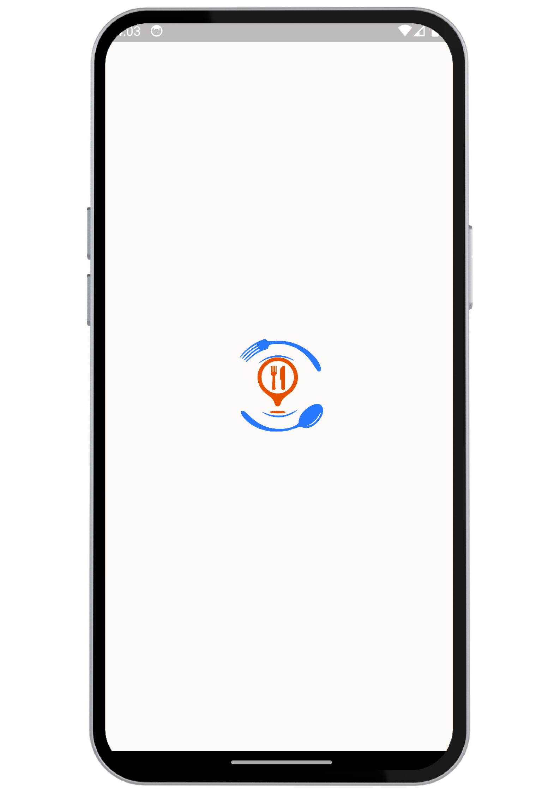
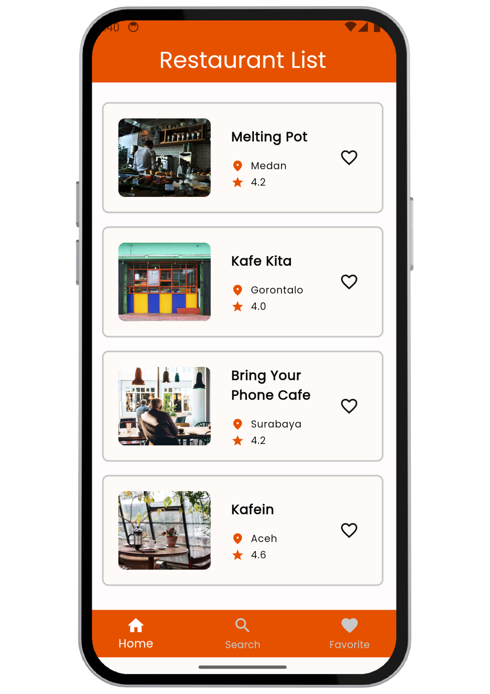
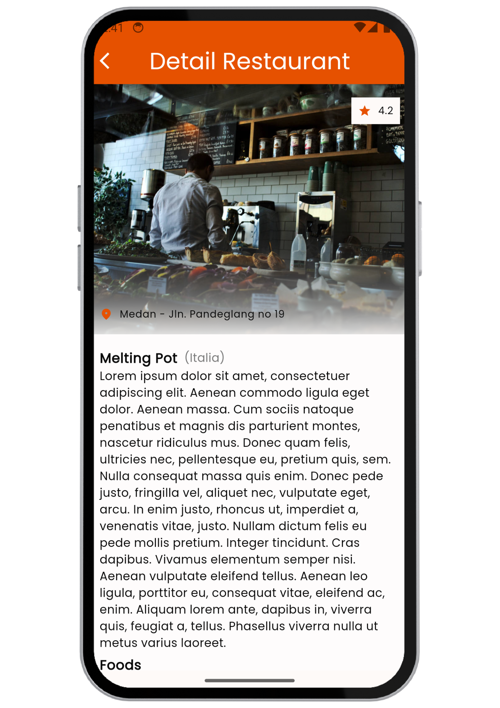
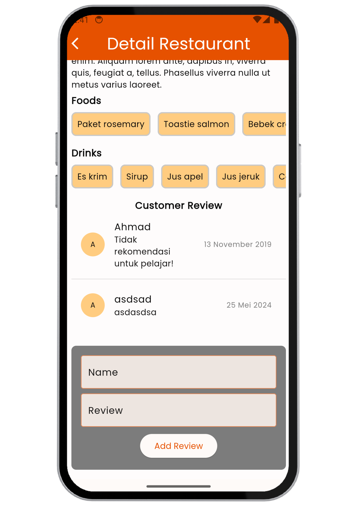
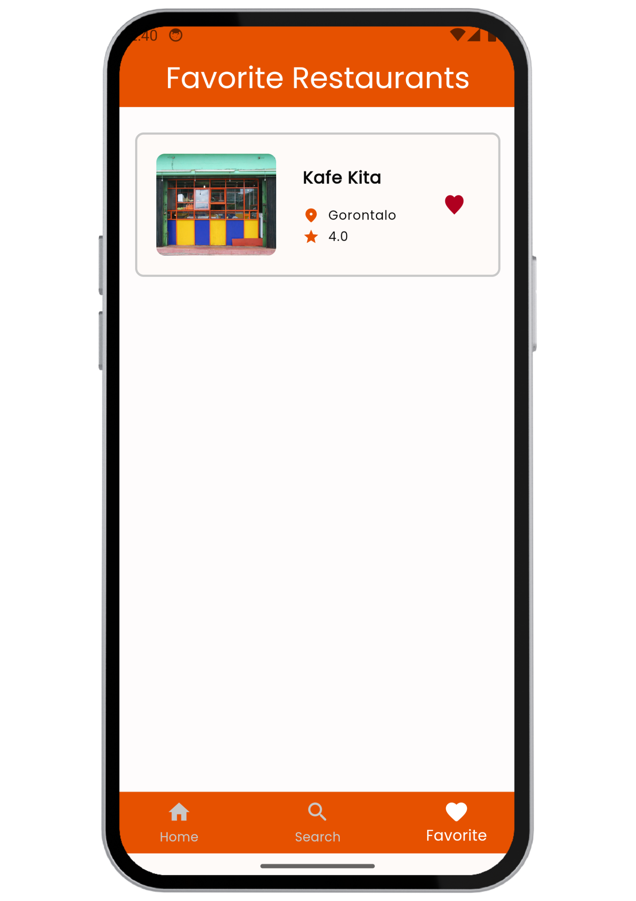

<a name="readme-top"></a>

[![Contributors][contributors-shield]][contributors-url]
[![Forks][forks-shield]][forks-url]
[![Stargazers][stars-shield]][stars-url]
[![Issues][issues-shield]][issues-url]
[![MIT License][license-shield]][license-url]
[![LinkedIn][linkedin-shield]][linkedin-url]

<br />
<div align="center">
  <a href="https://github.com/77leviann/nongkuy">
    
  </a>

<h3 align="center">Nongkuy</h3>

  <p align="center">
    Submission Belajar Fundamental Aplikasi Flutter<strong> Dicoding Academy</strong>. </p>
    <br />
    <a href="https://github.com/77leviann/nongkuy"><strong>Explore the docs »</strong></a>
    <br />
    <br />
    <a href="https://github.com/77leviann/nongkuy">View Demo</a>
    ·
    <a href="https://github.com/77leviann/nongkuy/issues/new?labels=bug&template=bug-report---.md">Report Bug</a>
    ·
    <a href="https://github.com/77leviann/nongkuy/issues/new?labels=enhancement&template=feature-request---.md">Request Feature</a>
    <br />
    <br />
  </p>
</div>

<details>
  <summary>Table of Contents</summary>
  <ol>
    <li>
      <a href="#about-the-project">About The Project</a>
      <ul>
        <li><a href="#built-with">Built With</a></li>
      </ul>
    </li>
    <li>
      <a href="#getting-started">Getting Started</a>
      <ul>
        <li><a href="#prerequisites">Prerequisites</a></li>
        <li><a href="#installation">Installation</a></li>
      </ul>
    </li>
    <li><a href="#screenshots">Screenshots</a></li>
    <li><a href="#roadmap">Roadmap</a></li>
    <li><a href="#contributing">Contributing</a></li>
    <li><a href="#license">License</a></li>
    <li><a href="#contact">Contact</a></li>
    <li><a href="#acknowledgments">Acknowledgments</a></li>
  </ol>
</details>

## About The Project


Nongkuy is an app tailored to offer users a selection of local restaurants, tapping into local data to provide an authentic dining experience.

<p align="right">(<a href="#readme-top">back to top</a>)</p>

### Built With

- [![Dart][Dart]][Dart-url]
- [![Flutter][Flutter]][Flutter-url]

```yaml
dependencies:
  flutter:
    sdk: flutter
  flex_color_scheme: ^7.3.1
  google_fonts: ^6.1.0
  sqflite: ^2.3.3+1
  path: ^1.9.0

dev_dependencies:
  flutter_test:
    sdk: flutter
  flutter_lints: ^3.0.0
```

<p align="right">(<a href="#readme-top">back to top</a>)</p>

## Getting Started

This guide will walk you through setting up your project locally. Follow these steps to get started.

### Prerequisites

Before you begin, ensure you have the following installed:

- [Flutter](https://flutter.dev/)
- [Dart](https://dart.dev/)

If you haven't installed Flutter yet, you can do so by following the instructions [here](https://flutter.dev/docs/get-started/install).

### Installation

1. Clone the repository:
   ```sh
   git clone https://github.com/77leviann/nongkuy.git
   ```
2. Navigate to the project directory:
   ```sh
   cd nongkuy
   ```
3. Run the following command in your terminal to get the necessary dependencies:
   ```sh
   flutter pub get
   ```
4. Run project.

<p align="right">(<a href="#readme-top">back to top</a>)</p>

## Screenshots

Below are some screenshots that demonstrate the usage of the project:

|                                                              |                                                              |                                                              |
| :----------------------------------------------------------: | :----------------------------------------------------------: | :----------------------------------------------------------: |
|                    **Splash Screen**                     |                     **Home Screen**                     |                    **Search Widget**                    |
|         |           |  |
|                    **Detail Screen**                    |                    **Detail Screen 2**                    |                    **Favorite Screen**                    |
|  |  |  |

<p align="right">(<a href="#readme-top">back to top</a>)</p>

## Roadmap

- [ ] Splash
- [ ] Home
- [ ] Detail
- [ ] Favorite

See the [open issues](https://github.com/77leviann/nongkuy/issues) for a full list of proposed features (and known issues).

<p align="right">(<a href="#readme-top">back to top</a>)</p>

## Contributing

Contributions are what make the open source community such an amazing place to learn, inspire, and create. Any contributions you make are _greatly appreciated_.

If you have a suggestion that would make this better, please fork the repo and create a pull request. You can also simply open an issue with the tag "enhancement".
Don't forget to give the project a star! Thanks again!

1. Fork the Project
2. Create your Feature Branch (git checkout -b feature/AmazingFeature)
3. Commit your Changes (git commit -m 'Add some AmazingFeature')
4. Push to the Branch (git push origin feature/AmazingFeature)
5. Open a Pull Request

<p align="right">(<a href="#readme-top">back to top</a>)</p>

## License

Distributed under the MIT License. See LICENSE.txt for more information.

<p align="right">(<a href="#readme-top">back to top</a>)</p>

## Contact

Levian Dandra - 77leviann@gmail.com

Project Link: [https://github.com/77leviann/nongkuy](https://github.com/77leviann/nongkuy)

<p align="right">(<a href="#readme-top">back to top</a>)</p>

## Acknowledgments

I would like to express my gratitude to the following individuals and organizations for their support and contributions to this project:

- **Open Source Libraries** - For the libraries and tools that made development easier and more efficient.
- **othneildrew** - For creating the [Best-README-Template](https://github.com/othneildrew/Best-README-Template), which inspired and assisted in the creation of this README.

Thank you all for your invaluable contributions!

<p align="right">(<a href="#readme-top">back to top</a>)</p>

[contributors-shield]: https://img.shields.io/github/contributors/77leviann/nongkuy.svg?style=for-the-badge
[contributors-url]: https://github.com/77leviann/nongkuy/graphs/contributors
[forks-shield]: https://img.shields.io/github/forks/77leviann/nongkuy.svg?style=for-the-badge
[forks-url]: https://github.com/77leviann/nongkuy/network/members
[stars-shield]: https://img.shields.io/github/stars/77leviann/nongkuy.svg?style=for-the-badge
[stars-url]: https://github.com/77leviann/nongkuy/stargazers
[issues-shield]: https://img.shields.io/github/issues/77leviann/nongkuy.svg?style=for-the-badge
[issues-url]: https://github.com/77leviann/nongkuy/issues
[license-shield]: https://img.shields.io/github/license/77leviann/nongkuy.svg?style=for-the-badge
[license-url]: https://github.com/77leviann/nongkuy/blob/master/LICENSE.txt
[linkedin-shield]: https://img.shields.io/badge/-LinkedIn-black.svg?style=for-the-badge&logo=linkedin&colorB=555
[linkedin-url]: https://linkedin.com/in/77leviann
[product-screenshot]: (images/screenshot/main_screenshot.png)
[Dart]: https://img.shields.io/badge/Dart-0175C2?style=for-the-badge&logo=dart&logoColor=61DAFB
[Dart-url]: https://dart.dev/
[Flutter]: https://img.shields.io/badge/Flutter-02569B?style=for-the-badge&logo=flutter&logoColor=white
[Flutter-url]: https://flutter.dev/
